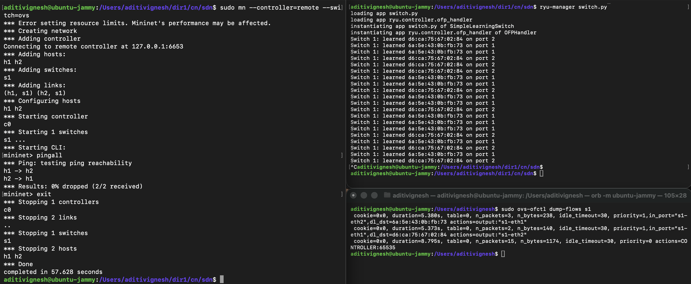
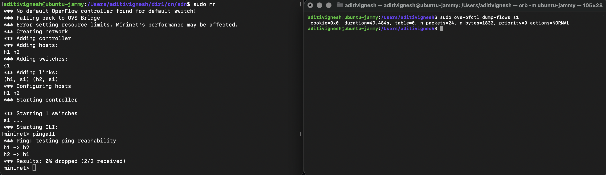
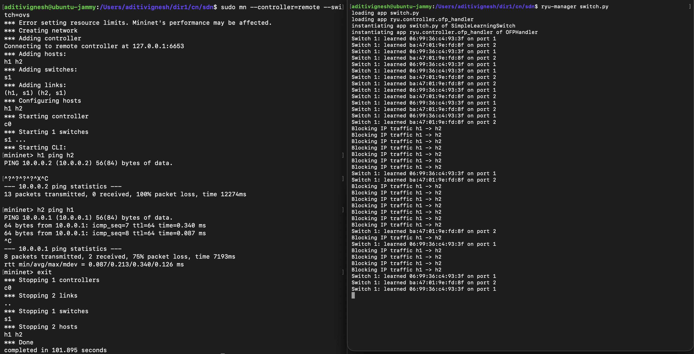
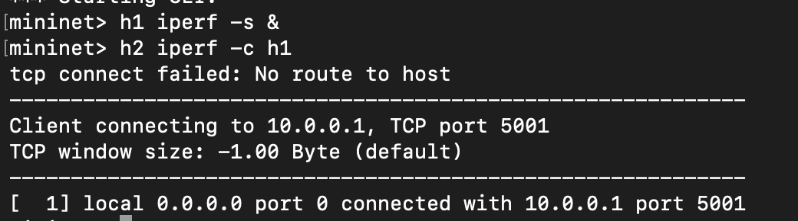

# Documentation
CN Mini Project using SDN

## Problem Statement 
Implement a controller that mimics a learning switch by dynamically learning MAC addresses and installing forwarding rules. 

### Project Expectations 
- MAC Address learning logic
- Dynamic flow rule installation
- Packet Forwarding Validation
- Flow Table Inspection

## Setup/Execution steps

### Requirements 
- A VM Running a Linux OS (Ubuntu 20.04/22.04) with sudo privileges and internet connectivity in VM.

### Commands Used
Mininet Installation 
```
sudo apt install mininet -y
or
sudo apt-get install mininet -y
```
Starting Mininet 
```
sudo mn 
```
Connectivity Test 
```
mininent>pingall 
```
Exit Mininet 
```
mininet>exit
```
OpenSwitch 
```
sudo apt install openvswitch-switch -y
```
Ryu Installation - note python3 with pip3 to be installed.
```
pip install ryu
```
Run switch.py
```
ryu-manager switch.py
```
Run Controller with mininet 
```
sudo mn --controller=remote --switch=ovs
```
Use openswitch with respect to switch 1
```
sudo ovs-ofctl dump-flows s1
```

## Expected output

### Network Behaviour Observation


### Normal vs Leaned Forwarding 


### Allowed vs Blocked Traffic

  
### Validation using iperf 



